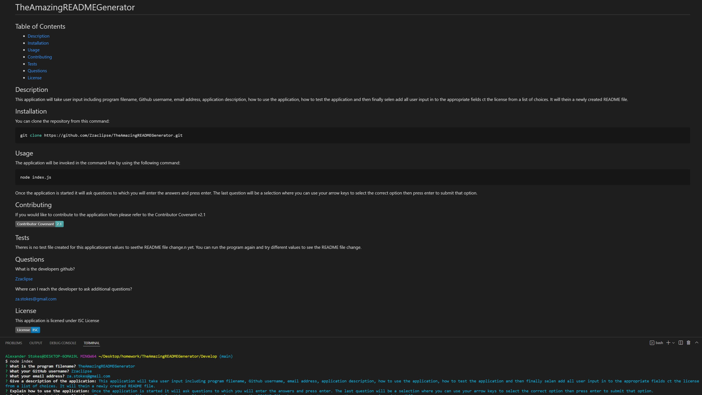

# TheAmazingREADMEGenerator

## Table of Contents

- [Description](#description)
- [Installation](#installation)
- [Usage](#usage)
- [Contributing](#contributing)
- [Tests](#tests)
- [Questions](#questions)
- [License](#license)

## Description

This application will take user input including program filename, Github username, email address, application description, how to use the application, how to test the application and then finally selen add all user input in to the appropriate fields ct the license from a list of choices. It will thein a newly created README file.

## Installation

You can clone the repository from this command:

```bash
git clone https://github.com/Zzaclipse/TheAmazingREADMEGenerator.git
```

## Usage

The application will be invoked in the command line by using the following command:

```bash
node index.js
```

Once the application is started it will ask questions to which you will enter the answers and press enter. The last question will be a selection where you can use your arrow keys to select the correct option then press enter to submit that option.

## Contributing

If you would like to contribute to the application then please refer to the Contributor Covenant v2.1

[](code_of_conduct.md)

## Tests

Theres is no test file created for this applicatiorant values to seethe README file change.n yet. You can run the program again and try different values to see the README file change.

## Questions

What is the developers github?

[Zzaclipse](https://github.com/Zzaclipse)

Where can I reach the developer to ask additional questions?

za.stokes@gmail.com

## License

This application is licened under ISC License

[](https://opensource.org/licenses/ISC)

## Link to video walkthrough

[Walkthough](https://drive.google.com/file/d/1RSf4ehacLyJ-1TZ5-PnMll5LtI203Lfr/view)

## Screenshot of created README with user input


